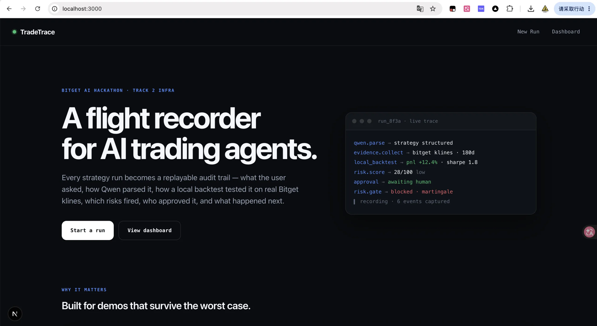
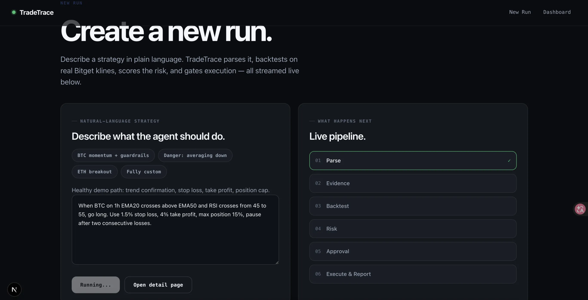
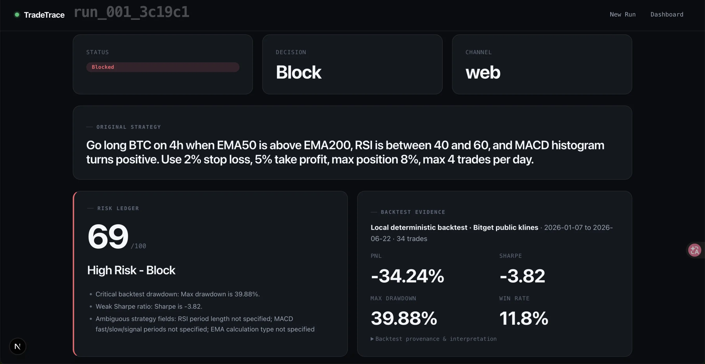

# TradeTrace — AI 交易智能体的"黑匣子"

> 一个开源的 AI 交易基础设施：记录智能体"为什么这么做"、在真实行情上回测策略、量化风险、在执行前把关，并把整次运行完整地、可回放地保留下来。
>
> English: [README.en.md](README.en.md)

TradeTrace 把每一次 AI 交易智能体的运行都变成可回放、可审计的轨迹：

```text
自然语言策略 → Qwen 解析 → Bitget Skill 证据包 → 本地确定性回测（真实 Bitget 公共 K线）
            → 风险账本 → 审批闸门 → 模拟 / 回放执行 → 运行后报告
```

> **这个项目本身就是一套 AI 交易基础设施（AI trading infra）。** 它开箱即用地提供「记录 → 回测 → 风控 → 审批 → 执行 → 报告 → 回放」的完整治理骨架。你可以把它当作脚手架，把其中任何一环替换成你自己的实现：解析器、数据源、执行适配器、通知渠道都可以热插拔——详见 [作为基础设施：改造与接入](#作为基础设施改造与接入)。



AI 交易智能体能力很强，但作为黑盒是危险的——用户看不清它"为什么"做决策，工具调用、回测、风控、审批、执行散落各处，失败也无法复盘。TradeTrace 补的就是「自主智能体」和「交易执行」之间那层治理基础设施：**交易智能体版的黑匣子 + 驾驶舱语音记录器**。

核心立场：**风险评分是基于规则、确定性、可解释的；LLM 只负责解析和报告，绝不参与最终的安全决策。回测指标基于 Bitget 官方公共行情数据，真实可复现，不造假。**

本项目源自 [Bitget AI Hackathon](https://bitget-ai.gitbook.io/hackathon) Track 2（Trading Infra），但设计为赛后可继续生长的通用基础设施。

---

## 目录

- [它解决什么问题](#它解决什么问题)
- [安装](#安装)
- [快速开始](#快速开始)
- [接入方式](#接入方式)
- [作为基础设施：改造与接入](#作为基础设施改造与接入)
- [使用示例](#使用示例)
- [运行日志与复现](#运行日志与复现)
- [一次运行的流程](#一次运行的流程)
- [API 速查](#api-速查)
- [项目结构](#项目结构)
- [安全说明](#安全说明)

---

## 它解决什么问题

官方 Track 2（Trading Infra）的评审标准原话：**"别的开发者能不能低摩擦集成它；是不是真的解决了一个痛点，而不是再造一个已有的工具。"** TradeTrace 瞄准的是 AI 交易智能体缺失的那一层——**可观测性、可审计性、审批、回放、运行后分析**：

- 用户看不清智能体**为什么**做某个决策。
- 工具调用、回测输出、风险检查、审批、执行事件散落在各种日志/面板/聊天里。
- 没有一个以"一次运行"为单位的**标准审计轨迹**。
- 风险闸门经常是隐式的，甚至根本没有。
- 失败或危险的运行没法清晰回放、做不了复盘。

TradeTrace 不再造一个交易聊天机器人或策略生成器，而是把一次交易智能体运行的完整生命周期记录下来，让它可以被回放。

---

## 安装

### 前置要求

- **Node.js ≥ 18.17**（Next.js 要求；推荐 20 LTS）
- **npm**（随 Node 附带）
- 可访问外网：需要调用 Qwen 接口；回测需要访问 Bitget 公共行情接口（**无需任何 Bitget key**）

### 1. 克隆并安装依赖

```bash
git clone <repo-url>
cd bitget-hackathon-infra
npm install
```

### 2. 配置环境变量

```bash
cp .env.example .env
```

打开 `.env`，按下表填写。**只有 `QWEN_API_KEY` 是必填**——回测用的是 Bitget 公共行情接口，不需要任何 Bitget key。

| 变量 | 是否必填 | 说明 |
|---|---|---|
| `QWEN_API_KEY` | **必填** | Qwen 的 API Key，用于解析策略 + 生成运行后报告。比赛会发 key（走 Bitget 代理 base url）；也可用自己的 Qwen key。 |
| `QWEN_BASE_URL` | 已给默认值 | Qwen 接口地址（比赛代理：`https://hackathon.bitgetops.com/v1`）。 |
| `QWEN_MODEL` | 已给默认值 | 使用的模型名（`qwen3.6-plus`）。 |
| `TELEGRAM_BOT_TOKEN` | 可选 | 留空则只跑 Web UI；填了才启用 Telegram bot。 |
| `NEXT_PUBLIC_APP_URL` | 可选 | 用于拼 Telegram 返回的 run 链接。本地默认 `http://localhost:3000`。 |

> **回测不需要任何 Bitget key。** 本地确定性回测引擎（[agent/tools/local-backtest.ts](agent/tools/local-backtest.ts)）直接调用 Bitget 公共 K线端点 `https://api.bitget.com/api/v2/spot/market/candles`——这正是 Agent Hub `spot_get_candles` / `futures_get_candles` skill 背后打的接口，公共、免认证。

### 3. 启动

```bash
npm run dev
```

打开 [http://localhost:3000](http://localhost:3000)。即便没有 `QWEN_API_KEY`，应用也能浏览内置的 [sample 运行](#样本输入--输出无需-api-即可复现)。

### 可选：检查 / 构建

```bash
npm run typecheck   # TypeScript 类型检查
npm run build       # 生产构建
npm run start       # 以生产模式启动
```

---

## 快速开始

1. `npm install && cp .env.example .env`，填入 `QWEN_API_KEY`。
2. `npm run dev`，打开 [http://localhost:3000/runs/new](http://localhost:3000/runs/new)。
3. 粘贴一条自然语言策略（或用页面上的模板），点开始——控制台会实时流式打印 Qwen 解析、证据包、本地回测、风险评分、审批、报告事件。
4. 看 [samples/](samples/) 里两条已固化的真实运行（健康策略 +8.3% / 危险策略被拦截），无需 API 即可复现。

---

## 接入方式

系统有两个入口，**共享同一份 Run 存储**——在 Telegram 发起的运行，在 Web UI 里同样看得见、能审批，反之亦然。

### A. Web UI（主界面）

- 页面（**英文单语言，扁平路由**）：
  - `/` — 落地页
  - `/runs/new` — 新建运行（粘贴自然语言策略，流式控制台）
  - `/runs/<runId>` — 运行详情：飞行记录器时间线、风险账本、回测证据、审批按钮、运行后报告
  - `/dashboard` — 仪表盘
- 运行进入 `awaiting_approval` 状态时，详情页会出现 **Approve / Reject** 按钮（人在回路）。

**新建运行页**（粘贴自然语言策略，右侧 Live pipeline 实时追踪六个阶段）：



**运行详情页**（飞行记录器时间线、风险账本、回测证据、审批按钮、运行后报告）：



### B. Telegram Bot（互补渠道）

**本地无需真的接 Telegram**，也能模拟 webhook（见下方[使用示例](#使用示例)）。真实接入步骤：

1. 在 [@BotFather](https://t.me/BotFather) 创建 bot，拿到 `TELEGRAM_BOT_TOKEN`，填进 `.env`。
2. 部署到公网（如 Vercel），并把 `NEXT_PUBLIC_APP_URL` 设为部署域名。
3. 设置 webhook：

   ```bash
   curl "https://api.telegram.org/bot$TELEGRAM_BOT_TOKEN/setWebhook?url=https://你的域名/api/telegram"
   ```

4. 注册命令菜单（让 `/run` 等命令出现在输入框的命令自动补全里）：

   ```bash
   npm run telegram:register
   ```

5. 在 Telegram 里使用命令：

   ```text
   /run <自然语言策略>        # 发起一次运行（流式播报各阶段，到审批步骤时出现 Approve/Reject 按钮）
   /status <run_id>          # 查询状态与决策
   /report <run_id>          # 拉取报告摘要
   ```
   审批通过 `/run` 结果消息上的内联 **Approve / Reject** 按钮完成（无需手敲命令）。

---

## 作为基础设施：改造与接入

TradeTrace 不只是一个 Hackathon demo，它被设计成**一套可改造、可接入的 AI 交易基础设施**。所有核心能力都封装在边界清晰的工具模块里（[agent/tools/](agent/tools/)），每一层都有明确的替换点。下面列出几条最常见的改造路径。

### 可替换的扩展点

| 能力 | 当前实现 | 改造接入点 |
|---|---|---|
| 策略解析（NL → 结构化） | Qwen | [agent/tools/qwen-strategy-parser.ts](agent/tools/qwen-strategy-parser.ts) |
| 行情证据包 | Qwen 模拟 5 个 Skill persona | [agent/tools/bitget-skill-evidence.ts](agent/tools/bitget-skill-evidence.ts) |
| 回测引擎 | 本地确定性回测（Bitget 公共 K线） | [agent/tools/local-backtest.ts](agent/tools/local-backtest.ts) |
| 风险评分 | 基于规则、确定性、可解释 | [agent/tools/risk-engine.ts](agent/tools/risk-engine.ts) |
| 审批闸门 | Web UI + Telegram（人在回路） | [agent/tools/approval-gate.ts](agent/tools/approval-gate.ts) |
| 执行层 | replay 适配器（**不发送真实订单**） | [agent/agent.ts](agent/agent.ts) 中的 `executeReplay` |
| 通知渠道 | Web / Telegram | [agent/channels/](agent/channels/) |

只要遵守 [lib/types.ts](lib/types.ts) 里的类型契约（`StructuredStrategy`、`BacktestResult`、`RiskAssessment`、`Report` 等），就能把任意一环换成你自己的实现，而 Run 存储、时间线、回放、审计、报告生成这些治理能力**全部自动复用**。

### 1. 接入 Playbook（Bitget Agent Hub 编排）

本项目当前用代码串联运行生命周期（解析 → 回测 → 风控 → 审批 → 执行）。若你想用 **Bitget Playbook / Agent Hub** 做编排，只需把 [agent/agent.ts](agent/agent.ts) 里的阶段调用迁移到 Playbook 的步骤定义里——各 `agent/tools/*.ts` 都是无状态纯函数，可以直接作为 Playbook 的 tool / step 注册。Run bundle 的读写仍走 [lib/store.ts](lib/store.ts)，保证审计与回放不丢。

### 2. 接入 Bitget 官方 API / Skill

- **行情数据**：回测目前直接打 Bitget 公共 K线端点（免认证）。如需私有行情、WebSocket 推送或深度数据，填入 Bitget API key 并在 [agent/tools/local-backtest.ts](agent/tools/local-backtest.ts) 替换数据源即可。
- **执行**：默认执行层是 replay 适配器，**明确不发送真实订单**。要接入真实交易，在 `executeReplay` 处实现一个调用 Bitget 下单接口（`/api/v2/trade/place-order`）的适配器，并**务必保留审批闸门 + 风控前置**——这正是 TradeTrace 作为"黑匣子"的意义。

### 3. 接入 MCP（Model Context Protocol）

解析器、证据包、报告生成都是独立的工具调用，天然适合包成 **MCP tool** 暴露给任何 MCP 客户端（Claude Desktop、Cursor、Codex 等）。最小改造：把 [agent/tools/qwen-strategy-parser.ts](agent/tools/qwen-strategy-parser.ts) 等模块用一个 MCP server 封装，tool 的 input/output schema 直接复用 [lib/types.ts](lib/types.ts)。反过来，你也可以把 TradeTrace 作为一个 MCP 客户端，调用外部 MCP server 提供的行情 / 新闻 / 链上工具来丰富证据包。

### 4. 接入 getclaw / 第三方 Hermes / OpenClaw 等

执行层与渠道层都做了适配器化设计，可以对接社区交易执行框架与消息总线：

- **getclaw / OpenClaw** 这类执行框架：实现一个 `executeXxx(runId)` 适配器替代 `executeReplay`，把 TradeTrace 产出的决策（Go / Review / Block + 结构化策略）转成对方的下单/仓位语义。风控评分和审批状态会随 Run bundle 一起带过去，**执行前始终有可审计的闸门**。
- **Hermes** 等消息 / 事件总线：[agent/channels/](agent/channels/) 现在有 web 和 telegram 两个渠道适配器，新增一个 Hermes channel 即可把运行事件（阶段流转、审批请求、报告就绪）推到你的事件总线，或从总线接收触发运行的指令。

> 设计原则：**无论接入什么执行 / 数据 / 消息后端，TradeTrace 保证的那条「可回放、可审计、风控前置、人在回路」的治理链路不变。** 你换的只是"手和眼"，"黑匣子"本身是稳定的。

---

## 使用示例

> 以下 `curl` 命令假设服务已 `npm run dev` 跑在 `localhost:3000`，且已配置 `QWEN_API_KEY`。

### 示例 1：发起一次运行（健康策略）

```bash
curl -X POST http://localhost:3000/api/runs \
  -H 'content-type: application/json' \
  -d '{"strategy":"Short BTCUSDT on 1h timeframe using EMA12 crossing below EMA26 as the entry, with a 2% stop loss and 5% take profit. Trend-following short only."}'
```

期望返回一个 `RunBundle`，其中 `run.status` 为 `awaiting_approval`，`backtest.provider = local_deterministic`，`backtest.pnl` 是基于真实 Bitget K线算出的真实数值（不造假）。同时会在 `logs/<runId>/<时间戳>/` 下生成运行日志。

### 示例 2：查询运行详情

```bash
curl http://localhost:3000/api/runs/<runId>
```

返回该 run 的完整 bundle（含时间线事件、风险账本、回测及 `backtest.notes` 的可解释来源、报告）。

### 示例 3：审批 / 拒绝（人在回路）

```bash
# 批准（仅当状态为 awaiting_approval 时生效）
curl -X POST http://localhost:3000/api/runs/<runId>/approve \
  -H 'content-type: application/json' -d '{"reason":"checked risk ledger"}'

# 拒绝
curl -X POST http://localhost:3000/api/runs/<runId>/reject \
  -H 'content-type: application/json' -d '{"reason":"drawdown too high"}'
```

### 示例 4：危险策略（被拦截）

```bash
curl -X POST http://localhost:3000/api/runs \
  -H 'content-type: application/json' \
  -d '{"strategy":"Whenever price drops, keep adding to the position until it rebounds. Use high leverage and recover losses as fast as possible."}'
```

期望：`risk.level = High`、`score = 100`、`recommendation = Block`、`run.status = blocked`。风险账本会列出命中的关键规则（`no-martingale` critical、`high-leverage`、`missing-stop-loss`）。

### 示例 5：本地模拟 Telegram webhook

```bash
curl -X POST http://localhost:3000/api/telegram \
  -H 'content-type: application/json' \
  -d '{"message":{"chat":{"id":1},"text":"/run Short BTCUSDT when EMA12 crosses below EMA26, 2% stop loss, 5% take profit."}}'
```

返回一个 `sendMessage` 形式的 JSON，含创建的 `run_id` 和链接。

---

## 运行日志与复现

### 运行日志（含时间戳与调用量）

**每次运行都会在本地生成一份结构化日志**，按 run + 时间分目录存放：

```text
logs/
  run_001_a1b2c3/                 # 以 runId 分组（同一 run 的多次生命周期会聚在一起）
    20260618-080322/              # 本次生命周期的时间戳（UTC）
      run.log                     # NDJSON，每行一条带 ts 的结构化日志
      summary.json                # 本次调用的元信息 + 各 scope 的调用次数（调用量）
```

- **`run.log`**：每行一个 JSON，字段含 `ts`（ISO 时间戳）、`level`、`scope`、`message`，以及来自 provider 的 `status` / `attempt` / `url` / `model` 等调用量字段。所有敏感字段（key、token、Bearer）会先经脱敏再写入。
- **`summary.json`**：聚合本次运行的 `call_counts_by_scope`（按 scope 统计调用次数）和 `total_log_calls`，便于一眼看出这次 run 各调用了几次 Qwen / 本地回测。

> 这些日志是**运行时由代码自动生成**的，不是手写示例。`logs/` 已加入 `.gitignore`，不会进仓库——评委在本地 `npm run dev` 跑一次上述任意示例，即可在 `logs/` 下看到真实日志。

### 样本输入 + 输出（无需 API 即可复现）

`samples/` 提供两条完整的「输入 → 输出」复现材料：

- **输入**：[`samples/strategies.md`](samples/strategies.md)——两条策略原文（健康 / 危险）。
- **输出**：[`samples/run-success.json`](samples/run-success.json)（趋势做空，**+8.3% PnL / Sharpe 2.95**，Review→批准→completed）、[`samples/run-blocked.json`](samples/run-blocked.json)（马丁格尔+高杠杆，High/100，blocked）。

两个输出文件都是完整的 `RunBundle`，且都**从真实的本地回测捕获**（`backtest.notes` 记录了来源）。存为 `backtest.provider = replay_fixture` 以便离线回放，但指标**不是造的**。`GET /api/runs` 会把这两个样本一并列出，所以即便没有 key 也能演示。

---

## 一次运行的流程

```text
自然语言策略 -> Qwen 解析 -> Bitget Skill 证据包 -> 本地确定性回测（真实 Bitget 公共 K线）
              -> 风险账本 -> 审批闸门
                              |
                              v
   运行后报告 <- 回放 / 执行 <- 模拟盘或 replay 运行 <- 决策(Go / Review / Block)
```

### 回测引擎（本地确定性，真实数据）

[agent/tools/local-backtest.ts](agent/tools/local-backtest.ts) 做：

1. 调用 Bitget 公共 K线端点拉历史 OHLCV（BTCUSDT 等，`1h` 等粒度，无需 key），落盘缓存到 `data/klines-cache/` 保证可复现。
2. 把 Qwen 解析出的 `StructuredStrategy` 解释成可执行规则（EMA 交叉 / RSI / 动量），尊重止损 / 止盈 / 方向。
3. 在历史序列上做**逐根 bar 的确定性模拟**（单仓、固定比例下单、bar 收盘评估），产出真实的 PnL / Sharpe / 最大回撤 / 胜率 / 交易数。
4. **诚实标注**：这是基于公开数据的回放模拟，不是真实交易所撮合。每条回测的 `backtest.notes` 记录了解释方式与数据来源。

回测**失败时绝不静默降级**——会显式标记 `status: 'failed'` 并把真实原因（如 K线拉取失败）显示在 UI 上。

### 证据包（Evidence Pack）技能优先级

1. `technical-analysis` — 最高优先级，验证策略触发条件与图表背景是否吻合。
2. `sentiment-analyst` — 执行前的人群 / 情绪风险信号。
3. `news-briefing` — 标题面 / 监管 / 交易所层面冲击。
4. `market-intel` — 流动性 / 波动率 / 背景信号。
5. `macro-analyst` — 低频否决层（CPI / FOMC / 利率风险）。

公开文档未给这五个 Skill Hub 技能暴露固定 REST 接口，因此证据包用 Qwen 模拟这五个 persona，使本地与部署后行为一致。Bitget 之后若开放官方可调用技能端点，替换点在 [agent/tools/bitget-skill-evidence.ts](agent/tools/bitget-skill-evidence.ts)。

---

## API 速查

```text
GET  /api/runs                  # 列出所有 run（含样本）
POST /api/runs                  # 发起一次运行  body: {"strategy": "...", "market"?: "..."}
POST /api/runs/stream           # 流式发起（NDJSON 进度流）
GET  /api/runs/:runId           # 运行详情
POST /api/runs/:runId/approve   # 批准  body: {"reason": "..."}
POST /api/runs/:runId/reject    # 拒绝  body: {"reason": "..."}
POST /api/runs/:runId/report    # 生成 / 刷新报告
POST /api/telegram              # Telegram webhook 入口
```

---

## 项目结构

```text
.
├── README.md / README.en.md
├── .env.example                # 环境变量模板（只有 QWEN_* 必填；回测无需 Bitget key）
├── agent/
│   ├── agent.ts                # 主运行生命周期（startRun / approve / reject / execute）
│   ├── instructions.md         # 智能体身份 & 安全边界
│   ├── tools/
│   │   ├── local-backtest.ts   # 本地确定性回测引擎（Bitget 公共 K线，纯 TS）
│   │   ├── qwen-strategy-parser.ts
│   │   ├── bitget-skill-evidence.ts
│   │   ├── risk-engine.ts      # 确定性、可解释的风险规则
│   │   ├── approval-gate.ts
│   │   ├── report-generator.ts
│   │   └── trace-event.ts
│   ├── skills/ subagents/ channels/ schedules/
├── app/                        # Next.js App Router（扁平路由，英文）
│   ├── page.tsx runs/ dashboard/
│   └── api/                    # runs / telegram 路由
├── components/                 # timeline / risk-ledger / evidence-pack / report-panel / approval-actions
├── lib/                        # 类型、env、store、redaction(脱敏)、logger(含日志落盘)
├── samples/                    # 回放 fixture（真实回测捕获）+ strategies.md
├── data/                       # 本地运行 / 事件存储 + K线缓存（JSON，gitignored）
└── logs/                       # 运行时按 run 生成的 API 调用日志（gitignored）
```

---

## 安全说明

- MVP **不会**执行真实资金的交易（执行层是 replay 适配器，明确不发送真实订单）。
- 任何样本运行、日志、Web UI **都不会**保存或显示密钥：日志经 `redactObject` 脱敏，`.env` 在 `.gitignore`。
- 风险评分是**基于规则、可解释的**；LLM 只负责解析和报告，不参与最终安全决策。
- 回测**不需要**任何 Bitget key；只有没配 `QWEN_API_KEY` 时才无法新建运行，应用仍服务 replay / sample 数据。

## 许可证

开源 — 见 [LICENSE](LICENSE)。
